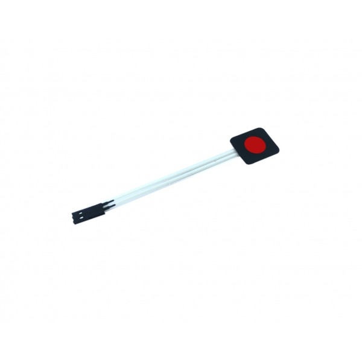
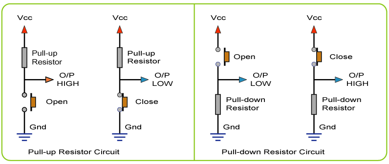
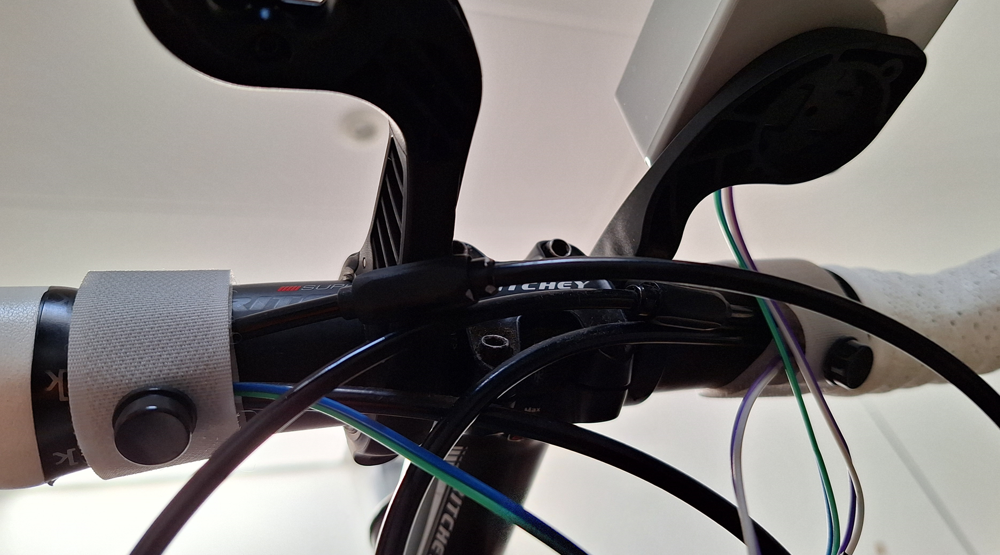

# Zwift-Control
Simple Zwift game BLE Remote Control with only 2 buttons

## Versions for 2 different SOC's:
- ESP32 with H2Zero's NimBLE library
- nRF52840 with Adafruit's Bluefruit library

## What it does:
The code turns an ESP32/nRF52 board into a 2 button (with 3 states) Bluetooth LE controller. Optimized for use with Zwift game to remotely initiate specific game actions that are mapped (by the Zwift app) to different keys of the regular keyboard.<br> 
In short: mimics some keys of your keyboard!

## Low cost DIY alternative for:
- Keith Wakeham's [Kommander](https://titanlab.co/715-2/) <br>
Review by DCRainmain: [Zwift Control For Your Handlebars](https://www.dcrainmaker.com/2021/02/kommander-review-zwift-control-for-your-handlebars.html)
- Some functionality of Zwift Play Controller (<b>NO</b> steering!)

## Mapping of 2 buttons to game actions
The code has implemented a limited set of the official mapping of keyboard shortcuts during the Zwift game: [see keyboard shortcuts](https://support.zwift.com/en_us/keyboard-shortcuts-rkGrgwd4B)<br>
Default Zwift keyboard mapping is one key to one action! The present code allows for 3 actions mapped to one key, since it can detect the difference between a single button click, a double button click and a "long" button click (longer than 0.5 second). Each of these will initiate a different game action.<br>
In addition the Zwift game knows two different modes: Freeride/Race and Workout mode. Some of the mappings will have only effect if in the "right" mode. The code will handle the different modes without your intervention, as detailed hereafter:

### Freeride/Race mode
|Action|Button #1|Button #2|
|---------------|--------------------------|--------------------------|
|One Click|Turn left at intersection|Turn right at intersection|
|Double Click|Power Up|Make an U-turn|
|Long|Change your Camera View| |

### Workout mode
|Action|Button #1|Button #2|
|---------------|--------------------------|--------------------------|
|One Click|Increase FTP|Decrease FTP|
|Double Click| | |
|Long|Change your Camera View|Skip a Workout Segment  |

## Wiring the buttons to the board

<br>

Connecting two push buttons to the board is quite easy but should be done correctly. Any push button will do but a membrane push button has the advantage that it is not very sensitive to fluids....<br>

<b>Wiring correctly</b><br>
Wire the buttons to the GPIO pins of the respective development boards in accordance with the settings in the code, or change the settings!
<br clear="left">

<b>PullUP</b><br>
The most simple setup is to activate and use the internal pullup resistor that these SOC's offer: connect a button at one side to the GPIO pin of your choice and the other button side to ground. When the button is pushed/closed the GPIO pin will go to logical LOW.
```C++
// Two Keys/Buttons settings connected to
#define PIN_BUTTON1    A0   // GPIO26 -> ESP32 Feather V2 
#define PIN_BUTTON2    A1   // GPIO25 -> ESP32 Feather V2
```
<br>
<p align=left>

</p>
<br clear="left">
<b>PullDOWN</b><br>
Connect a button at one side to the GPIO pin of your choice <b>and</b> to ground with a 10kOhm resistor. The other button side is connected to Vcc. When the button is pushed/closed the GPIO pin will go to logical HIGH.<br>

### Setup around the handlebars
Use your inventiveness to mount the electronics enclosure that houses the board and a LiPo battery near the handlebars. It is ritical that you can reach the buttons easily during a ride.Two obvious options:
- Mount the buttons on top of the pod (electronics enclosure) or
- Wire the buttons detached of the pod and tie the buttons to your handlebars

Notice how in this setup a modified cable binder (type Velcro strap) is holding the pushbutton:
 

 


